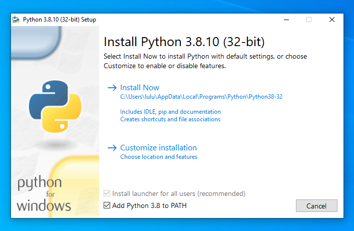
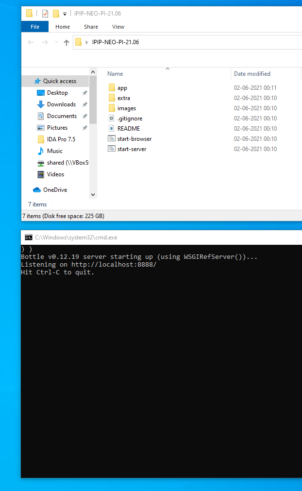

### IPIP-NEO

This project is a `Python 3 port` of Dr. John's IPIP-NEO software. This port
is able to run offline (disconnected from the internet).

IPIP-NEO-120 is an IPIP version of the NEO-PI-R test.

"The IPIP-NEO is not identical to the original NEO PI-R, but in my opinion it
is close enough to serve as a good substitute. More and more people are
beginning to use it in published research, so its acceptance is growing." - Dr.
Johnson

#### Upstream Resources

* http://www.personal.psu.edu/j5j/IPIP/ (original website)

* Dr John A. Johnson (j5j [at] psu [dot] edu)

#### Installation on Windows

1. Download and install `Python 3.8.10 32-bit` from [this link](https://www.python.org/ftp/python/3.8.10/python-3.8.10.exe).

   Please select the `Add Python 3.8 to PATH` option in the Python installer.

   

   Note: For older `Windows XP` systems, install `Python 3.4.4` from [this link](https://www.python.org/ftp/python/3.4.4/python-3.4.4.msi).
   Please select the `Install for all users` option in the Python installer.

2. Download and extract the `IPIP-NEO-PI` software ZIP file. Click [here](https://github.com/kholia/IPIP-NEO-PI/archive/21.06.zip) to download.

3. Run the `IPIP-NEO web server` by clicking on the `start-server.bat` file. After
   doing so, you should see something like,

   

4. Open the IPIP-NEO test in the browser by clicking on the `start-browser.bat` file or by clicking [here](http://localhost:8888).

5. [OPTIONAL] We recommend using the `Firefox` web browser. Firefox can be downloaded from the https://www.mozilla.org/ website.

#### Reporting

The test results are saved in a local SQLite database file called `app\results.db`.

You can view this SQLite database file using the https://sqlitebrowser.org/
software.

To view historical tests, click [here](http://localhost:8888/reporting). Doing
so opens the http://localhost:8888/reporting page in your browser.

#### Internal Components

* Bootstrap

* Bottle 0.12.19

* jqPlot 1.0.9.d96a669

* Selenium

#### Credits

* Dr John A. Johnson

* Dhiru Kholia

* Dr KJ Divina Kumar

#### Notes

All development work happens on Linux (Ubuntu).

For testing, we run Windows XP, 7, and 10 Virtual Machines using VirtualBox.

For testing against the upstream website, use `time python3
randomized_combo_tester_v4.py` command.

#### License

Public Domain. See https://ipip.ori.org/newPermission.htm for more information.

#### Resources

* http://www.personal.psu.edu/j5j/IPIP/ipipneo300.htm

* http://www.personal.psu.edu/~j5j/IPIP/ipipneo120.htm

* http://www.personal.psu.edu/~j5j/papers/ConferencePapers/2011ARP.pdf

* http://www.personal.psu.edu/j5j/IPIP/

* http://www.personal.psu.edu/faculty/j/5/j5j/papers/IPIP2006.pdf

* http://personality-project.org/pmc.html

* https://ipip.ori.org/

* https://ipip.ori.org/newneofacetskey.htm

* http://personality-project.org/r/psych/

* http://sapa-project.org/

* http://personality-project.org/pmc.html

* http://www.personality-project.org/r/book/

* http://personality-testing.info/

* http://pages.uoregon.edu/sanjay/bigfive.html

* http://en.wikipedia.org/wiki/Revised_NEO_Personality_Inventory

* https://en.wikipedia.org/wiki/International_Personality_Item_Pool
